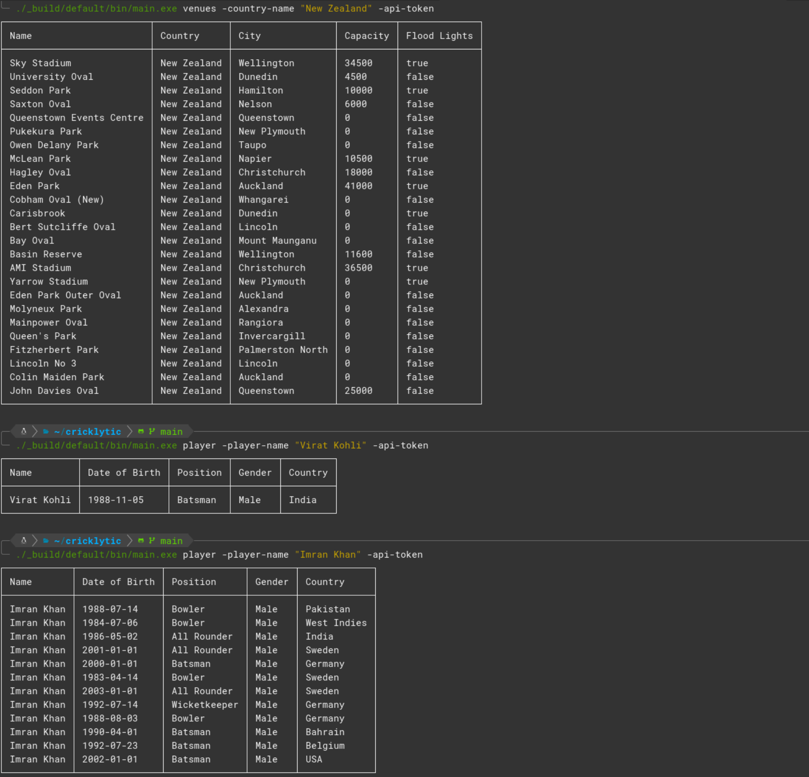

# Cricklytic

This is a CLI application that allows you to query the Sportmonk API for basic information about cricketers, venues and countries. Some information related to cricketers may include their date of birth, playing position, nationality and gender. For venues, you can find its country, city, capacity and facilities.

#### `dune build --profile release`

Creates the release executable for the application to run. An example of how to run the application is shown below. Note: The API key is removed from the image. To acquire an API key, visit [here](https://www.sportmonks.com/cricket-api)

### Screenshot Example

